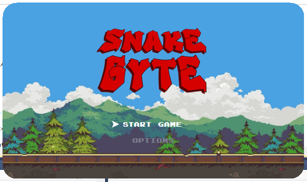
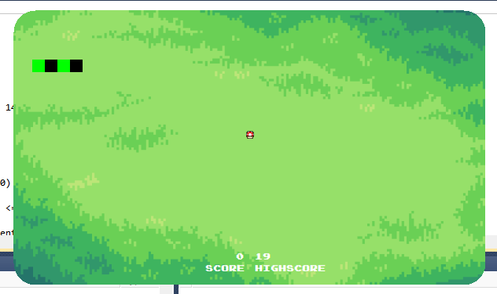
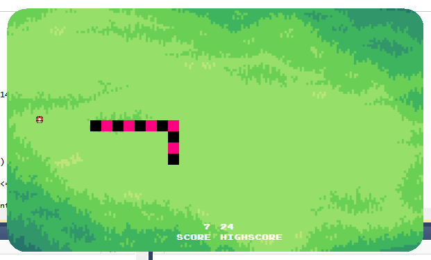
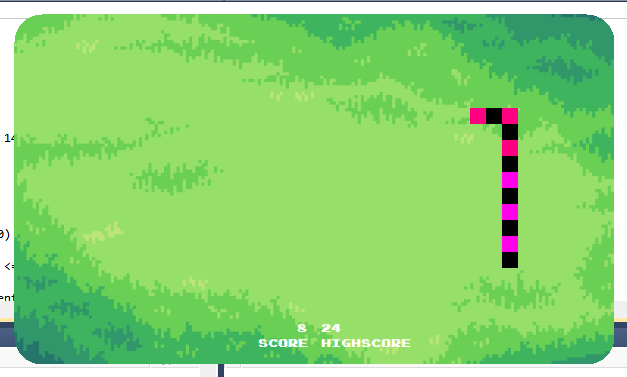
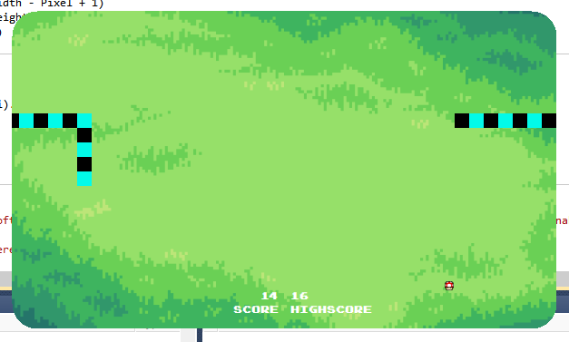
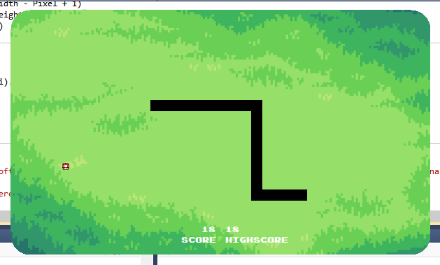
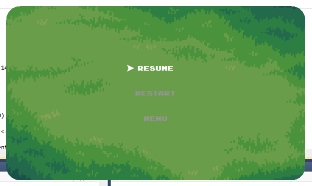
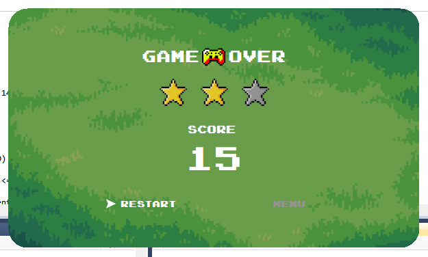

# Snake Byte

Snake Byte is a graphical Snake game developed in VB.NET Windows Forms during late 2024 to early 2025. It was my first UI-based game after working primarily with C, where my earlier programs were focused on terminal interaction. Moving to VB.NET introduced a different way of building software, where program logic could be connected to visual elements and user interaction, which led to the idea of building a game that could be experienced through a graphical interface.

The game implements the core mechanics of Snake, including movement, growth, food spawning, collision detection, teleportation, scoring, and game-over handling. It also includes interactive menu, pause, resume, restart, and navigation states, along with keyboard controls and sound feedback. The snake's visual appearance changes dynamically as the score increases, adding a small progression element to the gameplay.

Persistent high-score storage was implemented using Microsoft Access through OleDb, allowing scores to be stored and retrieved between game sessions.

## Screenshots

### Menu

### Gameplay

### Pause

### Game Over

## Built With

**VB.NET · Windows Forms · Microsoft Access · OleDb**

**2024 – 2025**
